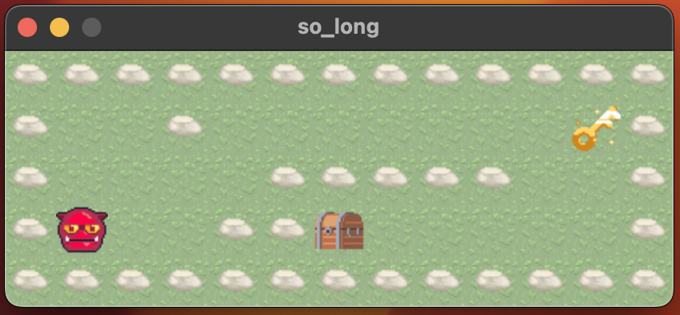

<div align="center">
<a></a>

# 42-so_long - 100% ✅
</div>
This project is a small 2D game with minilibx (École 42's graphic lib). Aims to learn about textures, sprites and tiles.

<br><div align="center"></div>

## Requirements
### For Linux (Debian-based)
```
sudo apt install gcc make xorg libxext-dev libbsd-dev
```

### For Windows 10/11 (with WSL2)
Follow the instructions from this repository https://github.com/codam-coding-college/MLX42

## Usage
`make` and execute `./so_long maps/mapfile.ber`. For example:
```
./so_long maps/map.ber
```
